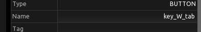
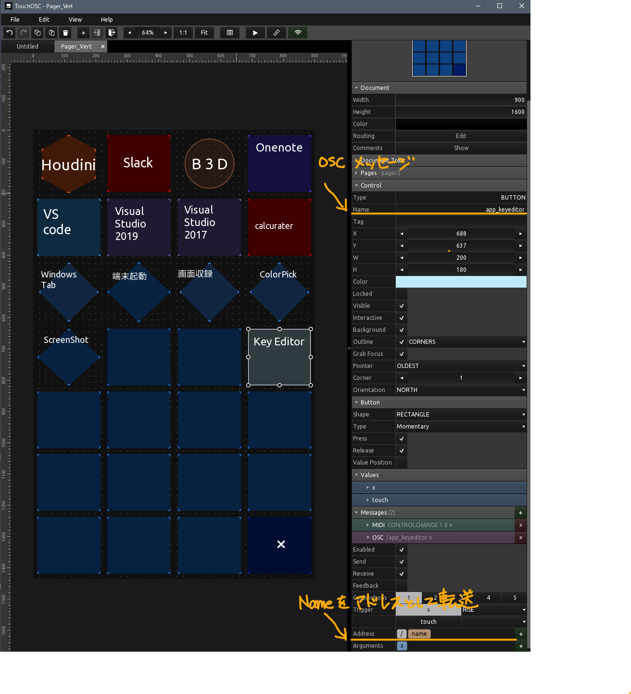

# oscLauncher（仮）

## 概要

特定のOSCメッセージを受けて、ショートカットやキーストロークを実行するアプリです。

## できること
- [x] キーコンビネーション
- [x] テンキー入力
- [x] アプリの起動
- [x] フォルダーの登録
- [x] コマンドの実行
- [x] テキストの入力（アルファベットのみ）
- [x] タッチスクロール
- [x] ピンチジェスチャー
- [ ] テキストの入力（UTF8? s-jis?）
- [ ] OSCエディター
- [ ] マウス入力(wheel / L R M X1 X2 ボタン)
- [ ] ペン入力(オンオフ・筆圧？・傾き？)

## 環境
##### 対応OS
* Windows10
##### 使用ライブラリ
* [openframeworks](https://openframeworks.cc/) 11.2 + ofxOSC
##### 連携アプリ
* touchOSC
  

## 使い方

### 準備
[touchOSC](https://hexler.net/touchosc)を使ったサンプルをリリースに含んでいます。
リリース内の` sample.tosc `を開きtouchOSCで設定します。
* touchOSCの送信先をPCのアドレスします。
* touchOSCの送信先ポートを設定します。デフォルトは12345
* touchOSCの受信ポートを設定します。デフォルトは12346

` appList.json `内の` listenPort `をtouchOSCの送信先ポート番号に
` targets `にtouchOSCをインストールした送信デバイスのアドレスを設定します。
` targets `の` port `touchOSCの受信ポートを書き込みます。

### 使用
起動:アイコンをダブルクリックします。
touchOSCからOSCメッセージ送ります。

設定ファイル
| ファイル名 |内容|
| :-: | :-: |
|appList.json|ショートカットなどの設定ファイル
|key.json|キー入力とVK_KEYの紐づけ
|config.json|その他の基本設定


## メッセージプロトコル（仮）

OSCのアドレスにトリガーとして、下記のアドレスを設定します。

#### キーコンビネーション
```
/key_A_B
```
| /key | A | B |
| :-: | :-: | :-: |
| キーコンビネーション | 修飾キー | 入力 |

* C - control
* W - windows
* A - alt
* S - shift
  
ショートカット設定例(Windows + tab)

アドレス設定例
```
    /key_W_tab ( windows + tab )
```
-------------------
#### アプリの起動
```
/app_A
```
| /app | A | B |
| :-: | :-: | :-: |
| アプリ起動 | キーワード | CLIオプション |
アドレス設定例
```
    /app_vscode ( "vscode" として登録されているフォルダを開く)
```
-------------------
#### フォルダーの登録
```
/f_A
```  
| /f | A |
| :-: | :-: |
| フォルダーショートカット | パス |

区切りは"\\\\"
アドレス設定例
```
    /f_code ( "code" として登録されているフォルダを開く)
```
-------------------
#### コマンドの実行
```
/cmds_A
```
| /cmds | A |
| :-: | :-: |
| コマンド | パス |
-------------------
#### テキストの入力
```
/txt_A
```
| /txt | A |
| :-: | :-: |
| テキストペースト | テキスト |
アドレス設定例
```
    /txt_ABCdef ( ABCdef の文字列をペースト)
```
-------------------
### URL開く
```
/url_A_B
```
| /url | A |
| :-: | :-: |
| URLを開く | アドレス |
アドレス設定例
```
    /url_youtube ( "youtube"として登録されているURLを開く)
    /url_twitter ( "twitter"として登録されているURLを開く)
```
-------------------
### Windows + R + text
```
/WR_string
```
| /WR | string |
| :-: | :-: |
| Win+R | 文字列 |
アドレス設定例
```
    /WR_hdwwiz.cpl ( hdwwiz.cplを実行 = デバイスマネージャーを開く)
    /WR_shell:Downloads ( = shellコマンド：ダウンロードを開く)
    /WR_bthprops.cpl ( bthprops.cplを実行 = bluetoothセッティングを開く)
```
-------------------
#### サウンド周り
```
/sys_snd_A
```
デバイス全体の音量を変えてしまう。現状デバイス毎に変える実装にはなっていない。
| /sys | snd | A |
| :-: | :-: | :-: |
| システム | 種別 | オプション |

**osc値**
|  | A |値 |
| :-: | :-: | :-: |
| スピーカ音量 | spk | float 0-1 |
| マイク音量 | mic | float 0-1 |
| スピーカミュート | smute | bool |
| マイクミュート | mmute | bool |
-------------------
#### タッチスクロール
```
/xy_A
```
| /xy | A |
| :-: | :-: |
| システム | タッチID |

**osc値**
|  | 値 |
| :-: | :-: |
| x | float 0-1 |
| y | float 0-1 |
| touch state | bool |
-------------------
#### ピンチズーム
```
/pinch
```
-------------------
#### マウス入力
-------------------
#### ペン入力
-------------------
####メッセージ設定例
